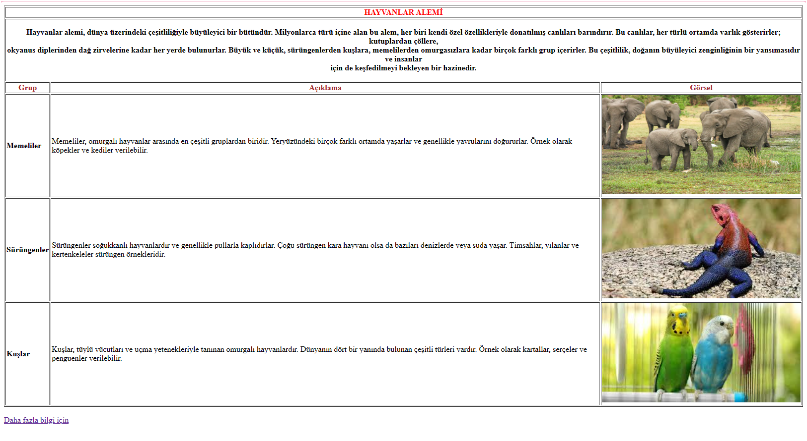

# Tablolarla Çalışma-Hayvanlar Alemi

Bu proje, HTML kullanarak basit bir "Hayvanlar Alemi" web sayfası oluşturmayı amaçlamaktadır. Web sayfası, farklı hayvan gruplarını tanıtan bir tablo içerir ve her bir grup için bir resim ve açıklama sunar.

## Özellikler

- "Hayvanlar Alemi" başlıklı ana sayfa.
- Memeliler, Sürüngenler ve Kuşlar olmak üzere üç farklı hayvan grubunu tanıtan alt başlıklar.
- Her hayvan grubu için bir resim ve açıklama içeren bir tablo.
- "Daha fazla bilgi için" adında bir Wikipedia bağlantısı.

## Nasıl Başlanır

1. Bu repository'yi klonlayın veya ZIP olarak indirin.

2. Projenin kök dizininde `index.html` dosyasını bir web tarayıcısında açın.

## Web Tarayıcı Görüntüsü

