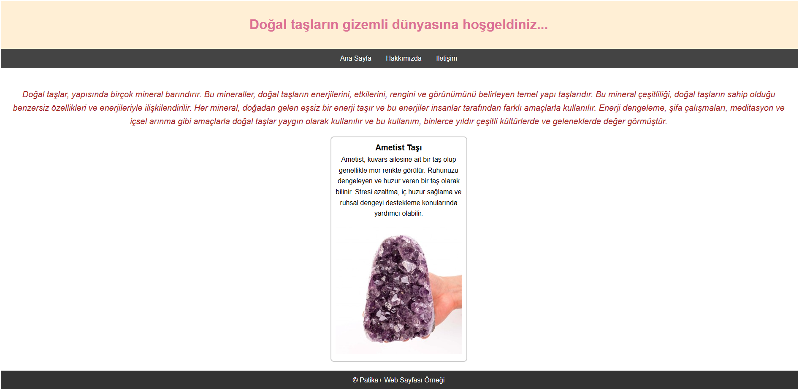
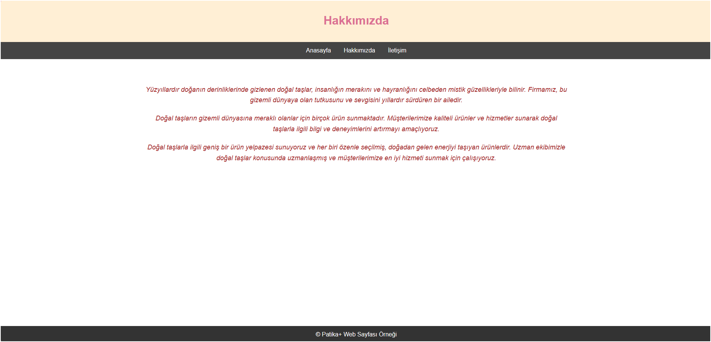
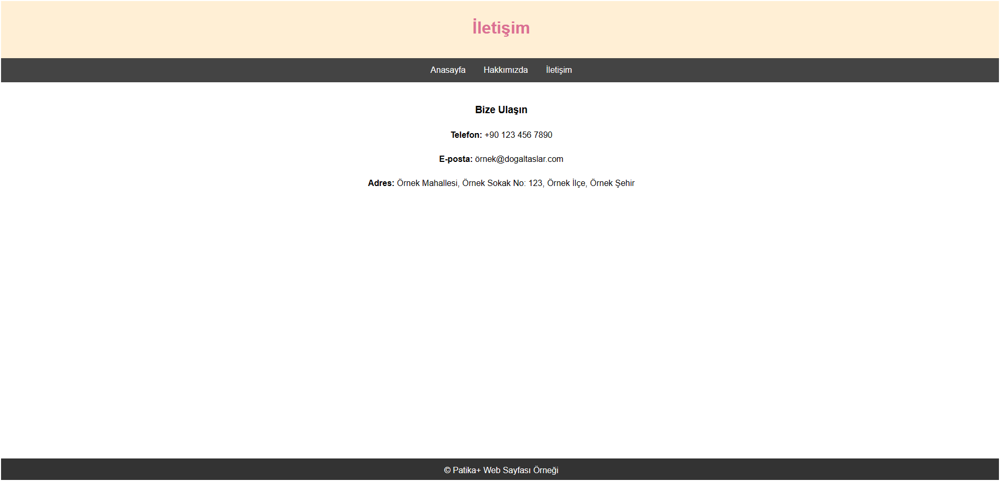

## Features

- Homepage: Provides general information about natural stones and showcases their images.
- About Us: Describes the purpose of the website owner.
- Contact Page: Includes contact information provided for users.

## Technologies Used

- HTML
- CSS

## Screenshots

## Installation and Usage

1. Download or clone the project files to your computer.
2. Open the project in a text editor or view the website by opening the index.html file in your browser.

